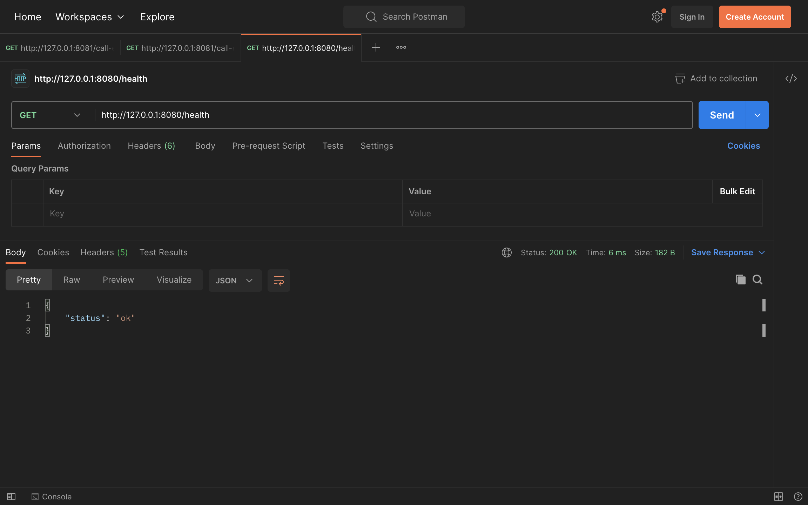
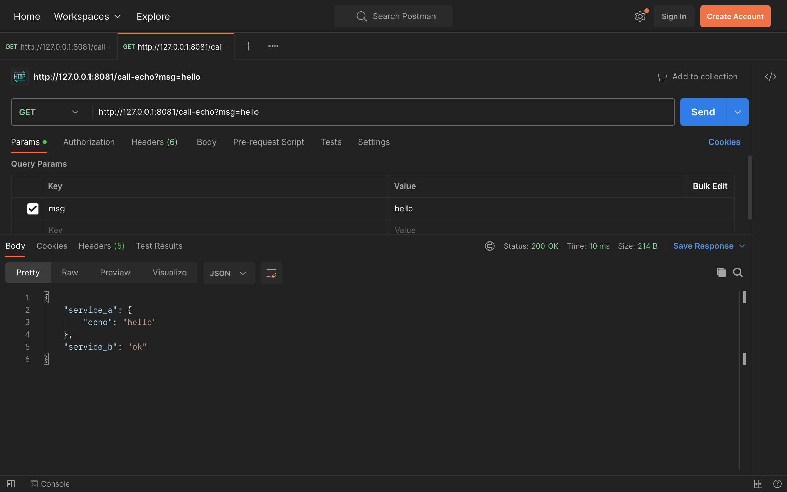
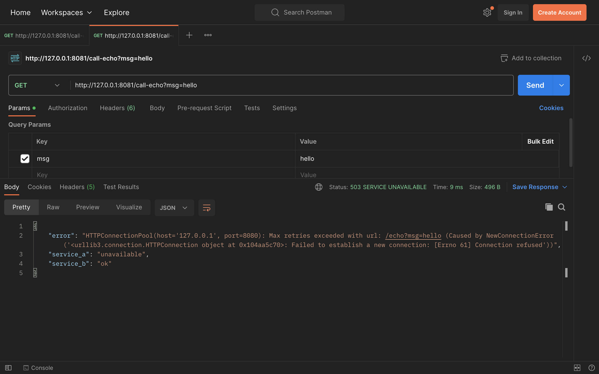

# Python HTTP track — local run guide

## Prerequisites
- Python 3.10+
- `curl` for manual verification (or `Postman` for GUI-based testing)

## Launch Service A
1. `cd service-a`
2. `python -m venv .venv`
3. `source .venv/bin/activate`
4. `pip install -r requirements.txt`
5. `python app.py`

Service A listens on `127.0.0.1:8080`

## Launch Service B
1. Open a second terminal, then `cd service-b`
2. `python -m venv .venv`
3. `source .venv/bin/activate`
4. `pip install -r requirements.txt`
5. `python app.py`

Service B listens on `127.0.0.1:8081`

## Quick validation
- `curl http://127.0.0.1:8080/health`
- `curl http://127.0.0.1:8081/call-echo?msg=hello`

If Service A is stopped, Service B returns `service_a: "unavailable"` plus `503`.

## Cleanup
- Stop each flask server with `Ctrl+C`
- Remove `.venv` directories if you want a clean state

## What makes this is distributed
- The system is distributed since it runs on two different processes that communicate using the HTTP protocol rather than as a single program. Both the service has its own memory and fails independently, i.e., when service A crashes, service B still keeps on running and handles the error gracefully and returns a `503` error instead of completely failing, which would have been the case had these services been running on the same process.

# Screenshots

## Health CURL
 

## Successful CURL

## Failure CURL
 